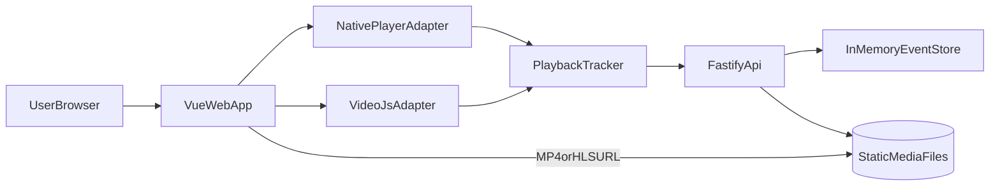

# Video Player PoC Implementation Plan

**Goal**
Build a greenfield monorepo that compares video playback in Vue across two frontend lanes (`native <video>` and `Video.js`) and two delivery modes (`plain MP4` and `HLS`), with a Fastify backend serving media and collecting normalized playback analytics.

**Recommended shape**
Use `pnpm` workspaces with `apps/web`, `apps/api`, and `packages/shared`. Keep the MVP intentionally small: pre-generated media assets, static serving for MP4/HLS, one analytics ingestion endpoint, one comparison page in the frontend, and one shared event schema.

**Tech choices**

- Monorepo: `pnpm` workspaces only; skip Turborepo/Nx for the first cut. Commit `pnpm-lock.yaml` from the first scaffold commit.
- FE: Vue 3, Vite, TypeScript, Vue Router, Pinia or a tiny local store. Vite dev server proxies `/api` and `/media` to Fastify so the browser sees a single origin and CORS is avoided entirely.
- Player lanes: native HTML5 `<video>` baseline and `Video.js` as the comparison library.
- HLS: use native HLS on Safari; use `hls.js` unconditionally for the native lane on Chrome/Firefox/Edge. `Video.js` handles HLS in its own lane via its bundled tech.
- BE: Fastify + `@fastify/static` (byte-range support is built in, no custom work) + simple in-memory analytics store.
- Media pipeline: pre-generate MP4 and HLS assets from the same source file with `ffmpeg`; no on-the-fly transcoding.

## Proposed repo layout

- `[package.json](package.json)`: root workspace scripts for install/dev/test/build.
- `[pnpm-workspace.yaml](pnpm-workspace.yaml)`: workspace definition.
- `[tsconfig.base.json](tsconfig.base.json)`: shared TypeScript settings.
- `[packages/shared/package.json](packages/shared/package.json)`: shared package manifest; published as TS source via `"exports"` pointing at `src/index.ts` (no build step) and consumed as `"shared": "workspace:*"`.
- `[packages/shared/tsconfig.json](packages/shared/tsconfig.json)`: extends `tsconfig.base.json`.
- `[packages/shared/src/index.ts](packages/shared/src/index.ts)`: barrel re-exporting the event taxonomy.
- `[apps/web/package.json](apps/web/package.json)`: frontend dependencies and scripts.
- `[apps/web/src/main.ts](apps/web/src/main.ts)`: Vue bootstrap.
- `[apps/web/src/router/index.ts](apps/web/src/router/index.ts)`: routes for the comparison page.
- `[apps/web/src/pages/PlayerComparisonPage.vue](apps/web/src/pages/PlayerComparisonPage.vue)`: top-level PoC screen.
- `[apps/web/src/components/PlayerPanel.vue](apps/web/src/components/PlayerPanel.vue)`: reusable player card with controls and status.
- `[apps/web/src/components/EventLogPanel.vue](apps/web/src/components/EventLogPanel.vue)`: raw/normalized event feed.
- `[apps/web/src/players/native/createNativePlayer.ts](apps/web/src/players/native/createNativePlayer.ts)`: native player adapter and media event binding.
- `[apps/web/src/players/videojs/createVideoJsPlayer.ts](apps/web/src/players/videojs/createVideoJsPlayer.ts)`: Video.js adapter.
- `[apps/web/src/players/types.ts](apps/web/src/players/types.ts)`: adapter interface shared by both lanes.
- `[apps/web/src/tracking/normalizePlaybackEvent.ts](apps/web/src/tracking/normalizePlaybackEvent.ts)`: converts native/library signals into one event taxonomy.
- `[apps/web/src/tracking/usePlaybackTracker.ts](apps/web/src/tracking/usePlaybackTracker.ts)`: tracker composable that queues, timestamps, and posts events.
- `[apps/web/src/stores/playbackSession.ts](apps/web/src/stores/playbackSession.ts)`: holds active session state, selected player, selected media mode, and event list.
- `[apps/web/src/lib/mediaSources.ts](apps/web/src/lib/mediaSources.ts)`: URLs for MP4 and HLS fixtures served by the API.
- `[apps/web/src/styles/videojs.css](apps/web/src/styles/videojs.css)`: local Video.js style wiring if needed.
- `[apps/web/src/tests/normalizePlaybackEvent.test.ts](apps/web/src/tests/normalizePlaybackEvent.test.ts)`: unit tests for telemetry normalization.
- `[apps/web/src/tests/nativeAdapter.test.ts](apps/web/src/tests/nativeAdapter.test.ts)`: unit tests for native event mapping.
- `[apps/api/package.json](apps/api/package.json)`: backend dependencies and scripts.
- `[apps/api/src/server.ts](apps/api/src/server.ts)`: Fastify bootstrap.
- `[apps/api/src/app.ts](apps/api/src/app.ts)`: plugin registration and app factory for testing.
- `[apps/api/src/plugins/staticMedia.ts](apps/api/src/plugins/staticMedia.ts)`: static serving for MP4/HLS fixtures with correct headers.
- `[apps/api/src/routes/health.ts](apps/api/src/routes/health.ts)`: health check.
- `[apps/api/src/routes/mediaManifest.ts](apps/api/src/routes/mediaManifest.ts)`: metadata endpoint describing available fixtures and URLs.
- `[apps/api/src/routes/events.ts](apps/api/src/routes/events.ts)`: POST endpoint for FE telemetry and GET endpoint for reviewing captured events.
- `[apps/api/src/domain/eventStore.ts](apps/api/src/domain/eventStore.ts)`: in-memory event/session store for the PoC.
- `[apps/api/src/domain/mediaFixtures.ts](apps/api/src/domain/mediaFixtures.ts)`: canonical IDs and paths for sample media.
- `[apps/api/test/events.test.ts](apps/api/test/events.test.ts)`: API tests for analytics ingestion.
- `[apps/api/test/mediaManifest.test.ts](apps/api/test/mediaManifest.test.ts)`: API tests for media metadata.
- `[media/source/sample.mp4](media/source/sample.mp4)`: source fixture committed or locally provisioned.
- `[media/output/mp4/sample.mp4](media/output/mp4/sample.mp4)`: fast-start MP4 output.
- `[media/output/hls/sample/master.m3u8](media/output/hls/sample/master.m3u8)`: generated HLS playlist and segments.
- `[scripts/generate-media.sh](scripts/generate-media.sh)`: ffmpeg wrapper to generate outputs reproducibly.
- `[README.md](README.md)`: setup, prerequisites, and what the PoC compares.

## Architecture

## Delivery modes and comparison matrix

The MVP matrix should stay intentionally narrow:

- Native player + MP4
- Native player + HLS
- Video.js + MP4
- Video.js + HLS

The UI should make this matrix explorable without multiplying routes. Prefer one comparison page with:

- a player selector (`native`, `videojs`)
- a source selector (`mp4`, `hls`)
- a shared custom skip control set (`-10s`, `+10s`) so those actions are explicitly trackable
- a live event log and a compact metrics summary

## Shared event taxonomy

Normalize all playback signals into a stable payload contract in `[packages/shared/src/playbackEvents.ts](packages/shared/src/playbackEvents.ts)` and consume it in both apps. Include:

- `eventType`: `play_request`, `playing`, `pause`, `seek_start`, `seek_end`, `skip_forward`, `skip_backward`, `buffer_start`, `buffer_end`, `ended`, `error`
- `sessionId`
- `mediaId`
- `playerType`
- `deliveryType`
- `currentTime`
- `fromTime`
- `toTime`
- `deltaSeconds`
- `duration`
- `occurredAt`
- `bufferedRanges`
- `userAgent`

The frontend should distinguish user intent from media engine side effects:

- Button clicks emit `skip_forward` or `skip_backward` directly. Because skip buttons call `currentTime = ...` under the hood, the adapter must set an `intentLock` flag before mutating `currentTime` and swallow the resulting `seeking`/`seeked` pair so skip intent is not double-counted as a seek.
- Slider drags or timeline clicks emit `seek_start` and `seek_end` with `fromTime`/`toTime`. Only unlocked `seeking`/`seeked` pairs become seek events.
- Native media events (`waiting`, `playing`, `pause`, `ended`) fill in buffer and playback state transitions.

**Startup time definition.** `timeToFirstPlaying` is measured from the `play_request` event (user click on play, or autoplay attempt at mount) to the first `playing` event on the same session. It is not measured from component mount or source assignment — those happen before user intent and would conflate load time with user-perceived startup.

**Video element attributes.** The native lane mounts `<video>` with `preload="metadata"` and `crossorigin="anonymous"` by default. `preload` materially changes buffering behavior and therefore the analytics comparison — document the chosen value and keep it identical across both lanes so Video.js and native measurements are apples-to-apples.

## Backend plan

### Phase 1: workspace and app scaffolding

- Initialize the root workspace and shared TypeScript config.
- Scaffold `[apps/web](apps/web)` and `[apps/api](apps/api)` as independent apps under one workspace.
- Add root scripts for `dev`, `build`, `test`, and `lint` that delegate into workspace packages.

### Phase 2: media fixture pipeline

- Store one source video in `[media/source](media/source)`.
- Add `[scripts/generate-media.sh](scripts/generate-media.sh)` that:
  - rewrites the MP4 with `-movflags +faststart`
  - generates a small HLS output set from the same source
  - writes outputs into `[media/output/mp4](media/output/mp4)` and `[media/output/hls](media/output/hls)`
- Document ffmpeg as a local prerequisite in `[README.md](README.md)`.

### Phase 3: Fastify media/API server

- Build the app factory in `[apps/api/src/app.ts](apps/api/src/app.ts)` so tests can instantiate the server without starting a port.
- Serve media files from `[media/output](media/output)` via `@fastify/static` (byte-range support is provided out of the box; no custom range handling required).
- Verify correct content handling for:
  - MP4 delivery with byte-range requests (smoke test only — behavior is framework-provided)
  - `.m3u8` content type (`application/vnd.apple.mpegurl`)
  - HLS segment content types (`video/mp2t` for `.ts`, `video/mp4` for fMP4)
- No CORS configuration needed: Vite proxies `/api` and `/media` to Fastify in dev, so the browser sees one origin.
- Expose `[apps/api/src/routes/mediaManifest.ts](apps/api/src/routes/mediaManifest.ts)` to return canonical fixture metadata and URLs so the frontend does not hardcode paths.
- Expose `[apps/api/src/routes/events.ts](apps/api/src/routes/events.ts)` with:
  - `POST /events` to ingest normalized events
  - `GET /events` to inspect captured telemetry for debugging
  - optional `DELETE /events` to reset the in-memory store during local testing

## Frontend plan

### Phase 4: Vue app shell and comparison screen

- Build one main screen in `[apps/web/src/pages/PlayerComparisonPage.vue](apps/web/src/pages/PlayerComparisonPage.vue)`.
- Fetch the media manifest from the backend on load.
- Render one player panel at a time for the selected lane and source type.
- Show current playback state, current time, buffered amount, and last event.

### Phase 5: native player lane

- Implement `[apps/web/src/players/native/createNativePlayer.ts](apps/web/src/players/native/createNativePlayer.ts)` as the baseline adapter.
- Bind native `<video>` element events and translate them through `[apps/web/src/tracking/normalizePlaybackEvent.ts](apps/web/src/tracking/normalizePlaybackEvent.ts)`.
- Add explicit custom controls for skip forward/backward so intent is captured consistently.
- Support HLS by:
  - using native playback on Safari (detected via `video.canPlayType('application/vnd.apple.mpegurl')`)
  - using `hls.js` for the native lane on Chrome/Firefox/Edge — treat this as the default non-Safari path, not a fallback

### Phase 6: Video.js lane

- Implement `[apps/web/src/players/videojs/createVideoJsPlayer.ts](apps/web/src/players/videojs/createVideoJsPlayer.ts)` behind the same adapter contract as the native lane.
- Reuse the same event normalizer and session store so analytics and UI remain directly comparable.
- Keep the wrapper thin: mount/unmount the player cleanly, subscribe to Video.js events, and map them into the shared schema.

### Phase 7: analytics UI

- Implement `[apps/web/src/components/EventLogPanel.vue](apps/web/src/components/EventLogPanel.vue)` for raw event review.
- Add a lightweight summary section showing:
  - startup time to first `playing`
  - total buffering count
  - cumulative buffering duration for the session
  - last seek delta
- Post events to the backend but also keep a local buffer in the FE so the screen is responsive even if the API is unavailable.

## Testing strategy

### Backend tests

- Add Fastify injection tests for `[apps/api/src/routes/mediaManifest.ts](apps/api/src/routes/mediaManifest.ts)`.
- Add route tests for `[apps/api/src/routes/events.ts](apps/api/src/routes/events.ts)` covering accepted payloads, reset behavior, and retrieval.
- Add one smoke assertion that media fixture URLs returned by the manifest resolve to expected file paths or route prefixes.

### Frontend tests

- Unit test `[apps/web/src/tracking/normalizePlaybackEvent.ts](apps/web/src/tracking/normalizePlaybackEvent.ts)` against native/videojs event inputs.
- Unit test skip and seek payload generation from `[apps/web/src/tracking/usePlaybackTracker.ts](apps/web/src/tracking/usePlaybackTracker.ts)`.
- Add one component test for `[apps/web/src/pages/PlayerComparisonPage.vue](apps/web/src/pages/PlayerComparisonPage.vue)` to verify source/lane switching and event log rendering.

### Manual verification checklist

- MP4 starts playing without downloading the entire file first.
- Pausing mid-playback shows whether buffering continues in the network panel.
- Seeking emits `seek_start` and `seek_end` with correct `fromTime`/`toTime`.
- Skip buttons emit `skip_forward` and `skip_backward` with correct deltas.
- HLS playback works on Safari natively and via fallback in non-Safari browsers.
- Buffering events are visible under throttled network conditions.

## Milestones

1. Monorepo boots with both apps running and the `packages/shared` workspace package consumed by both.
2. Backend serves one MP4 fixture and one HLS fixture plus a manifest endpoint.
3. Native lane plays MP4 and HLS and emits normalized telemetry.
4. Video.js lane plays MP4 and HLS and emits the same telemetry schema.
5. Comparison page shows live event logs and summary metrics.
6. README documents setup, ffmpeg prerequisites, and the interpretation of results.

## Risks and guardrails

- HLS behavior differs by browser, so document Safari-native versus fallback behavior explicitly in the UI and README.
- Large sample media should not bloat the repo; if the source asset is too large, use a small fixture or document a local download step.
- Keep analytics intentionally session-scoped and in-memory; persistent storage is out of scope for the MVP.
- Avoid adding more players until the native and Video.js lanes are stable, otherwise the PoC turns into integration churn instead of a clean comparison.

## Suggested execution order

1. Scaffold workspace and shared package.
2. Add media generation script and fixture outputs.
3. Build Fastify manifest/media/events endpoints.
4. Build the Vue comparison page and native lane.
5. Add the Video.js lane.
6. Add analytics summary UI and finish tests/docs.
